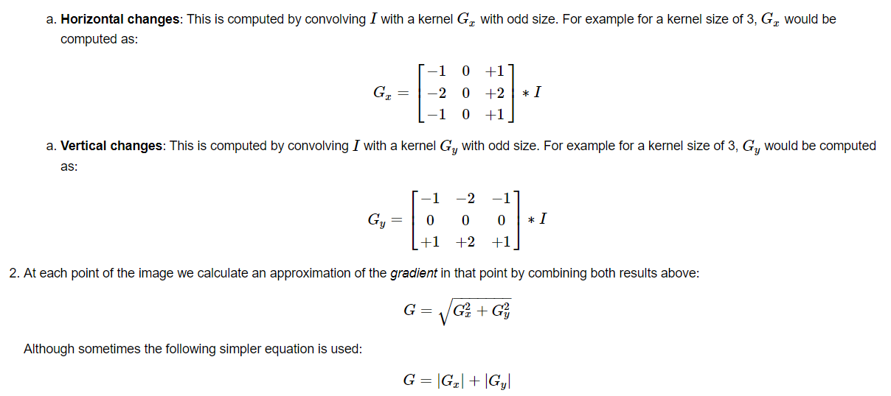

# Фильтр собеля
Фильтр Собеля — это один из распространенных операторов обнаружения границ в изображениях и фильтров обработки изображений. Он используется для выделения контуров и изменений яркости в изображении. 

Фильтр Собеля состоит из двух матриц (ядре), одна из которых используется для вычисления вертикальных градиентов, а другая — для горизонтальных градиентов. Эти градиенты затем комбинируются для получения окончательного результата.

Горизонтальное ядро (Sobel X):
$$
\begin{bmatrix} 
-1 & 0 & 1\\
-2 & 0 & 2\\
-1 & 0 & 1\\
\end{bmatrix}
$$
Вертикальное ядро (Sobel Y):

$$
\begin{bmatrix} 
-1 & -2 & -1\\
0 & 0 & 0\\
1 & 2 & 1\\
\end{bmatrix}
$$

Для применения фильтра Собеля к изображению каждый пиксель изображения умножается на соответствующие элементы ядра, а затем суммируются значения вокруг пикселя. Результатом является значение градиента яркости в данной точке изображения. Горизонтальное ядро выявляет вертикальные границы, а вертикальное — горизонтальные границы.

## Sobel Operator
Мы вычисляем "производные" в направлениях x и y. Для этого мы используем функцию Sobel(), как показано ниже: Функция принимает следующие аргументы:

- **src_gray**: В нашем примере входное изображение. Вот это CV_8U
- **grad_x / grad_y** : Выходное изображение.
- **depth**: глубина выходного изображения. Мы установили его равным CV_16S, чтобы избежать переполнения.
- **x_order**: порядок следования производной в направлении x.
- **y_order**: порядок следования производной в направлении y.
- **scale, delta  и BORDER_DEFAULT**: мы используем значения по умолчанию.
Обратите внимание, что для вычисления градиента в направлении x мы используем: xorder=1 и y order=0. Мы поступаем аналогично для направления y.